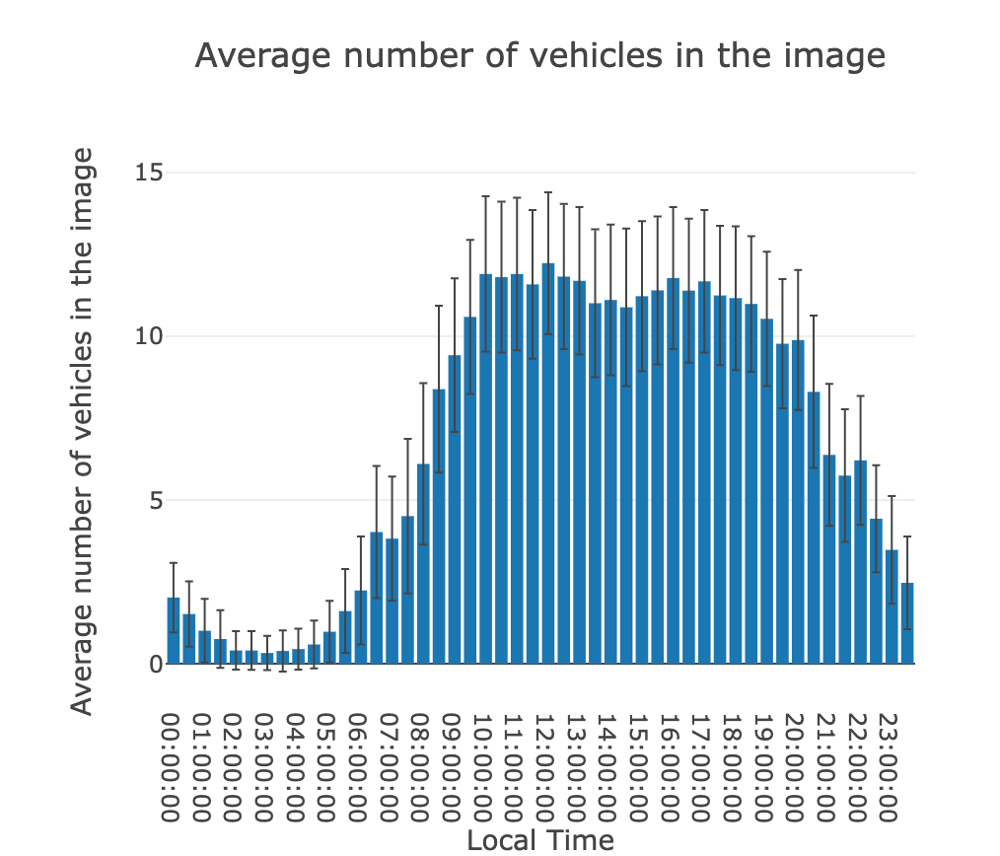
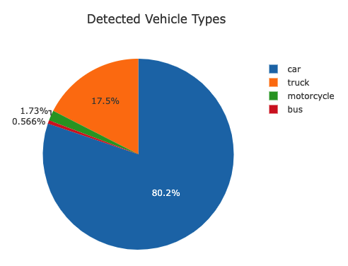

# Vehicle detection and analysis in live traffic cam
### Table of Contents
1. [Installation](#installation)
2. [Problem Introduction](#introduction)
3. [Strategy to solve the problem](#strategy)
4. [Metrics](#metrics)
5. [Modelling & Hyperparameter tuning](#modelling)
6. [File Descriptions](#files)
7. [Results](#results)
8. [Conclusion/Reflection](#conclusion)
9. [Improvements](#improvements)
10. [Licensing](#licensing)

### Installation

Apart from the Anaconda distribution of Python following libraries have been used: `plotly`, `pytorch`, `youtube-dl`,
`ffmpeg-python`, `flask`, `sql-alchemy`.
The code should run with no issues using `python>=3.8`. For more information about the requirements check the
[YOLOv5 repo](https://github.com/ultralytics/yolov5/).

### Problem Introduction

Automatic analysis of the vehicles in a webcam feed might be useful for different purposes. 
For example one could estimate how busy a certain street or intersection is
depending on the time of the day or investigate whether the timing of traffic
light can be further optimized.

### Strategy to solve the problem

In this project I use the deep learning model [YOLOv5](https://github.com/ultralytics/yolov5/)
to detect vehicles in a video live stream.
The current frame of the live stream is extracted using `ffmpeg`. Subsequently, different
types of vehicles are detected in the image and the results are stored in the database
for further analysis. The results are then presented in a web app using `flask`.

### Metrics

I wanted to answer the questions such as:

- How many vehicles on average are present in the picture depending on the time of the day.
- What are the proportions of cars, truck, buses and motorcycles.

### Modelling & Hyperparameter tuning
not applicable

### File Descriptions

- `detect_vehicles.py` grabs the current frame from a [YouTube stream](https://www.youtube.com/watch?v=1EiC9bvVGnk), detects the vehicles
and then the saves results to a database. The stream url is hardcoded for now.
- `app/run.py` starts the web server which can be accessed at `0.0.0.0:3001`.

### Results

 The analysis of a single image takes about 4.5s on my old Lenovo ThinkPad with Intel i7-3520m from 2012.

The following graphs were created from this [YouTube stream](https://www.youtube.com/watch?v=1EiC9bvVGnk).
As expected there is almost no traffic during the night, and it is the busiest between 10am and 7pm.

Of all detected vehicles around 80% are cars and 17.5% trucks and pickups

The web app can be accessed [here](http://nsckir.ddns.net:3001).

### Conclusion/Reflection

The YOLOv5 model performs very consistently, detecting even those cars which appear
tiny in the background. Object detection during the night might pose a problem in some
cases but the intersection in the YouTube stream which I chose for this
project is very good lit during the night, so it was not at all a problem. 

### Improvements

The speed of image analysis could be improved significantly using a GPU. In that case
the object detection could be combined with an object tracking algorithm such as DeepSORT
to enable traffic counting or measuring the time to cross the intersection.

Since YOLOv5 newer versions of the model have been published showing higher speed and
accuracy.

### Licensing

Must give credit to [Ultralytics](https://ultralytics.com/) for the YOLOv5 model.
Feel free to use my code here as you would like!